# RHEL Server Provisioning & Hardening (In Progress)

A secure, repeatable provisioning baseline for a RHEL server, built across two VirtualBox VMs — a management/control machine and a managed web server — using role-based access control, least-privilege permissions, and automated user onboarding.

## The Problem

Manually setting up new Linux servers doesn't scale and doesn't stay secure. Without a repeatable process, every server ends up configured slightly differently — inconsistent user access, forgotten firewall rules, SSH left open to password authentication, no monitoring. This is a common source of configuration drift and security gaps in small teams that haven't yet adopted configuration management tooling.

## The Solution

This project provisions a RHEL server to a known-good, secure baseline using a set of automation scripts and deliberate access-control design:

- **Automated user onboarding** from a CSV source of truth, with password expiry policy enforced at creation
- **Role-based access control** — three distinct roles (`admin`, `webteam`, `auditor`) with sudo privileges scoped to exactly what each role needs, not blanket access
- **Least-privilege file permissions**, reasoned individually per directory based on actual runtime and maintenance needs, backed by a stricter system-wide default (`umask 027`)
- **LVM-backed storage** for web content, allowing flexible resizing without the constraints of static partitioning
- A working web service, hardened SSH access, firewall rules limited to essential ports, and SELinux left in enforcing mode

The goal is a reproducible starting point — the kind of baseline a junior admin would be expected to build and maintain before a team moves to full infrastructure-as-code (Ansible/Terraform).

## Skills Demonstrated

- User & group lifecycle management, password aging policy (`useradd`, `chage`, `chpasswd`)
- Role-based sudo access via `/etc/sudoers.d/` drop-in files
- File/directory permission design, `umask` policy
- LVM storage management (physical volumes, volume groups, logical volumes)
- Static networking and hostname configuration
- systemd service management
- SSH hardening (key-based authentication only)
- Package management (`dnf`)
- Shell scripting with structured logging and secrets handling
- Git version control
- *(planned)* Task scheduling, centralized logging review, firewalld, SELinux context management, containerization with Podman

## Build Journey

The sections below walk through the project in the order it was actually built, each with evidence from the working environment.

### 1. Network Foundation

Two VirtualBox VMs — a client (control/dev machine) and a web server — connected over a private Host-Only network, separate from the NAT adapter used only for outbound package management traffic.

*Confirming connectivity between the two VMs over the private network.*  
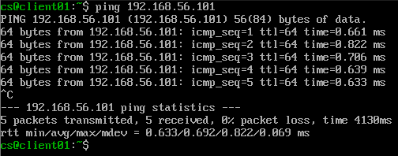

*First SSH connection from the client VM into the web server, password-authenticated at this stage.*  
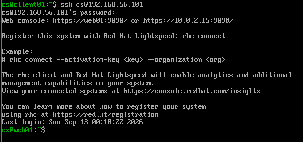

### 2. Automated User Provisioning

A CSV source of truth drives a shell script that bulk-creates users, assigns role-based groups, sets password expiry policy, and generates temporary credentials that force a password change on first login.

*The source-of-truth CSV: username, full name, role group, and password expiry policy per user.*  
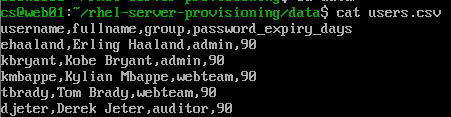

*The three role-based groups (`admin`, `webteam`, `auditor`) created ahead of provisioning.*  
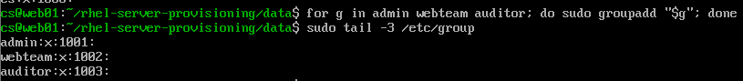

*Running the provisioning script and confirming the result — all users created in a single pass with correct group membership.*  
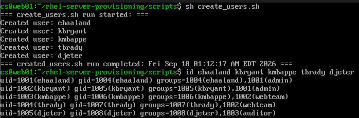

*Password aging policy confirmed per user — expiry set from the CSV, immediate change required at first login.*  
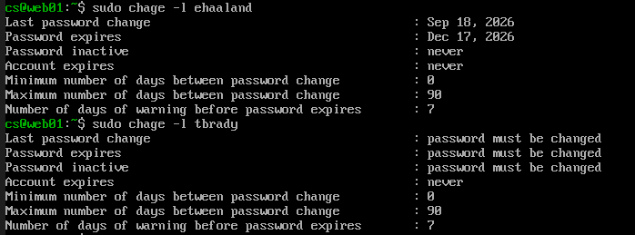

*A newly provisioned user is required to set their own password before gaining shell access — temporary credentials are never left standing.*  
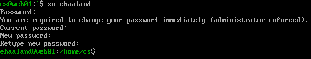

### 3. Role-Based Access Control & Least-Privilege Permissions

Rather than a single blanket `wheel` grant, access is modeled around three distinct roles, each defined in its own `/etc/sudoers.d/` file and scoped to exactly what that role needs:

| Role | Access | Rationale |
|---|---|---|
| `admin` | Full sudo | System administration, user provisioning |
| `auditor` | Read-only inspection commands (`journalctl`, `sestatus`, `getenforce`) | Models a compliance/audit function — verify configuration and review logs without any ability to modify the system |
| `webteam` | Scoped to web content/service management | Defined once web service configuration is finalized |

Project directories are owned individually (for accountability) but group-owned by `admin` for role-based shared access, with permissions reasoned per directory based on actual runtime and maintenance needs rather than applied uniformly.

*Script ownership: individual owner retained, group ownership set to `admin`.*  
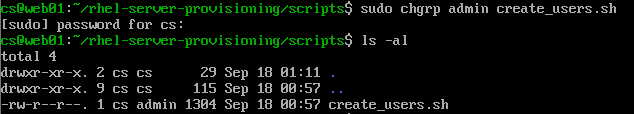

*Same pattern applied to the source-of-truth data file.*  
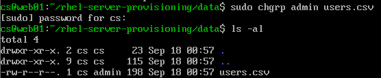

*Group ownership set consistently across all provisioning-related directories.*  
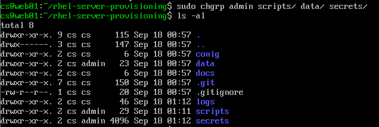

*Final permissions: read/execute-only where no write is needed at runtime, read/write where the script or manual maintenance genuinely requires it — `secrets/` locked down further still.*  
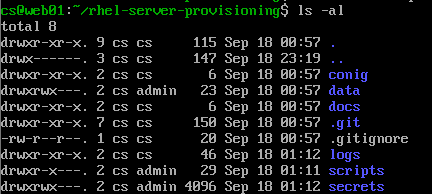

A system-wide `umask` of `027` replaces RHEL's default `022`, so new files are private by default (no access for anyone outside the owner and their group) rather than world-readable unless someone remembers to lock them down after the fact.

*Default file creation permissions tightened system-wide.*  
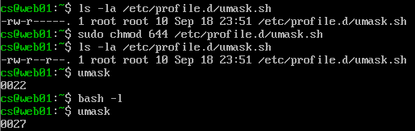

### 4. Storage — LVM

Web content storage is built on LVM rather than a static partition — chosen deliberately (and learned independently, ahead of where the accompanying course covers it) so the underlying storage can grow live as content needs increase, without downtime or reformatting.

A dedicated disk was allocated as a physical volume, pooled into a volume group, and a logical volume carved out at roughly half the group's total capacity — leaving the remainder available to extend into later. The volume is formatted XFS and mounted at `/var/www/html`, Apache's default document root, so all future web content lives on its own independently-resizable volume rather than sharing space with the OS.

*Physical volume created from a dedicated virtual disk.*  
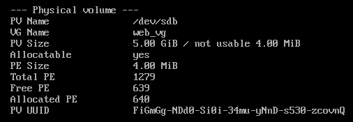

*Volume group pooling the physical volume into usable space.*  
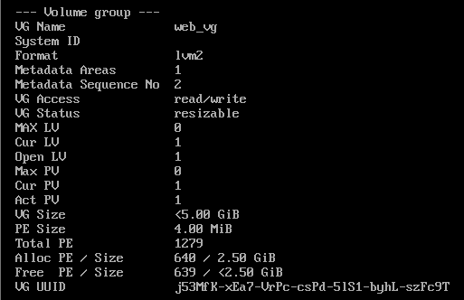

*Logical volume carved out of the volume group, sized to leave room for a future live extend.*  
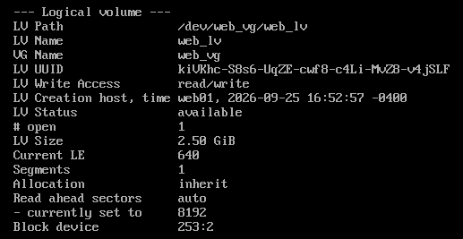

*Volume formatted XFS and mounted at Apache's default document root.*  
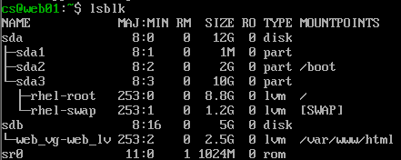
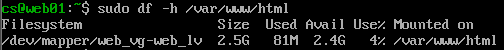

Mounting at `/var/www/html` surfaced a permissions gap introduced by the stricter system-wide `umask 027`: the intermediate `/var/www` directory, created via `mkdir -p`, inherited the tighter default and blocked traversal for any non-root user. Resolved by aligning ownership with the access-control model already in place — `/var/www` and `/var/www/html` group-owned by `webteam`, giving the team that manages web content full access while keeping the directory closed to everyone else.

*Ownership and permissions corrected on `/var/www` and `/var/www/html`.*  
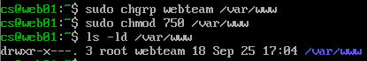
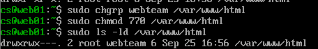

The mount was made persistent via `/etc/fstab`, referenced by UUID rather than device path for stability, and verified across an actual reboot rather than assumed to work.

*Persistent mount confirmed via `/etc/fstab` and surviving a reboot.*  

### 5. Web Service, Networking & Hardening *(planned)*

Static IP and hostname configuration, systemd-managed web service, SSH hardening to key-based authentication only, task scheduling for monitoring, firewalld rules limited to essential ports, and SELinux enforcing mode with correct file contexts.
